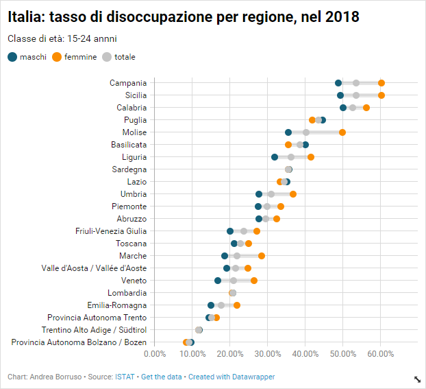
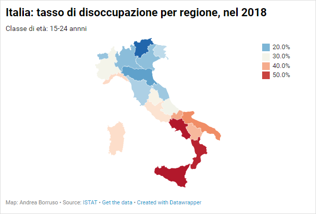
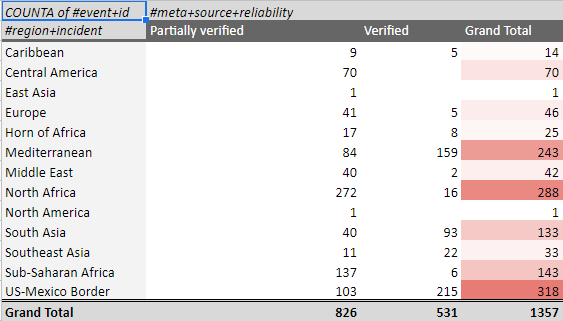
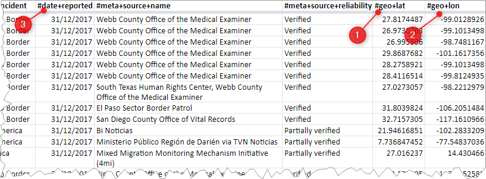
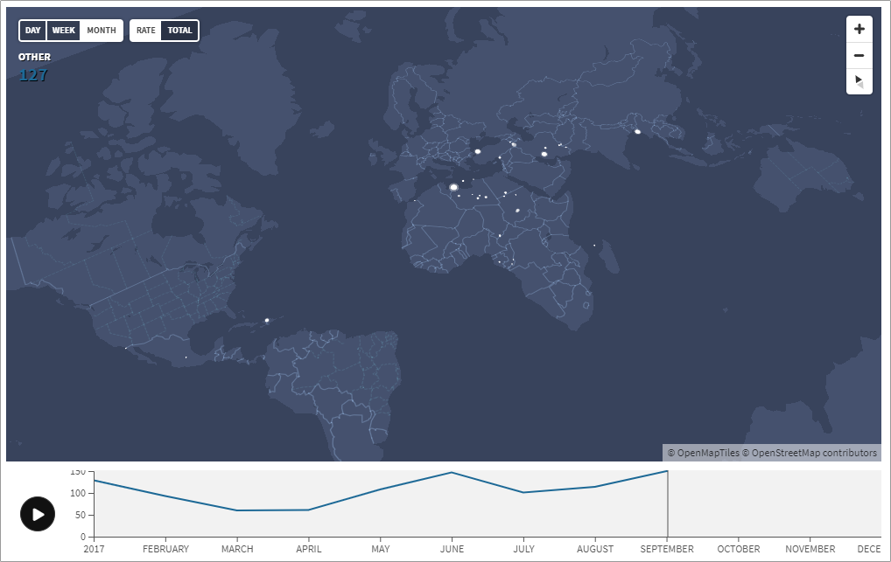

- [Introduzione](#introduzione)
- [La disoccupazione femminile nella fascia di età 15-24 anni nel 2018](#la-disoccupazione-femminile-nella-fascia-di-et%c3%a0-15-24-anni-nel-2018)
  - [Dati](#dati)
  - [Come creare un grafico dot plot con Datawrapper](#come-creare-un-grafico-dot-plot-con-datawrapper)
  - [Come creare una mappa coropletica](#come-creare-una-mappa-coropletica)
- [Le morti di migranti lungo le rotte migratorie in tutto il mondo, nel 2017](#le-morti-di-migranti-lungo-le-rotte-migratorie-in-tutto-il-mondo-nel-2017)
  - [Dati](#dati-1)
  - [Creare una tabella pivot](#creare-una-tabella-pivot)
  - [Creare una mappa dei punti degli incidenti, che mostri l'evoluzione del fenomeno nel tempo](#creare-una-mappa-dei-punti-degli-incidenti-che-mostri-levoluzione-del-fenomeno-nel-tempo)
- [Mappa sul report sull'omofobia](#mappa-sul-report-sullomofobia)

# Introduzione

Siamo stati invitati al [**Summer Lab sui diritti**](http://www.numeripari.org/2019/07/20/summer-lab-sui-diritti-be-pop-al-castello-di-santa-severa/) organizzato da  **A Buon Diritto** e **Be Pop**, dove abbiamo sviluppato la sessione denominata "Alla scoperta dei dati: ricerca, utilizzo e rappresentazione".

A seguire un piccolo riepilogo di alcune delle cose fatte in quelle ore, per le quali sono stati creati dei piccoli **video *tutorial*** (da visualizzare con le casse audio accesse), in modo che gli studenti possano replicarle *ex post*.

**Nota** per gli studenti del Lab: per ❓ **dubbi** e ❓ **domande** su quanto sviluppato sotto, per favore **fate una richiesta facendo click [qui]( https://github.com/ondata/summerlabdiritti/issues/new)** (si chiamano *issue*); in questo modo domande e risposte verranno messe a fattor comune (è una specie di forum).

# La disoccupazione femminile nella fascia di età 15-24 anni nel 2018

## Dati

I dati sono stati scaricati dal sito ISTAT dedicato ai dati: <http://dati.istat.it/>.

Qui un **video** che mostra **come scaricarli**: <https://youtu.be/FeDz44YdM_s>.

Una volta scaricati, i **dati** vanno "**puliti**": rimosse righe di intestazioni inutili, colonne vuote, rimosse righe descrittive a fondo tabella, ecc. Qui un **video** che mostra come fare: <http://youtu.be/4I1mFVYSgW8?hd=1>

Una copia dei dati è disponibile qui <https://docs.google.com/spreadsheets/d/1ltTQ0GjrceSW-F1GdkVBnZ5gMXXA3l3mMsWx4S2pYjk/edit?usp=sharing>.

## Come creare un grafico dot plot con Datawrapper

Una delle visualizzazioni sviluppate durante il laboratorio è un grafico *dot plot*, come quello sottostante. È un tipo di grafico che mostra, al variare di valori per una o più categorie, uno più punti lungo una linea (vedere esempio sotto).

Qui un video su come crearlo: <http://youtu.be/BB05kXjaMTo?hd=1>

## Come creare una mappa coropletica

Una mappa coropletica, è una rappresentazione in cui a delle aree (le regioni, gli stati, ecc.) sono assegnati dei colori in relazione a una data grandezza. 
Come quella sottostante, in cui le variazioni di colore esprimono la variazione del tasso di disoccupazione totale, nelle regioni di Italia.

Qui un video su come crearla: <http://youtu.be/ZgHZyDrtDwc?hd=1>

# Le morti di migranti lungo le rotte migratorie in tutto il mondo, nel 2017

## Dati

Il sito [Humanitarian Data Exchange](https://data.humdata.org/) (HDX) è una piattaforma aperta che ha l'obiettivo di rendere i dati umanitari facili da reperire e utilizzare per produrre delle analisi. Da questo sito, in particolare da [questa pagina](https://data.humdata.org/dataset/migrant-deaths-by-month), è stato scaricato il [file `xlsx`](https://missingmigrants.iom.int/global-figures/2017/HDXxls) con i dati sulle morti di migranti lungo le rotte migratorie in tutto il mondo, nel 2017.

## Creare una tabella pivot

Le tabelle pivot sono uno degli strumenti più comodi ed efficienti, per avere restituito una sintesi dei dati a disposizione. Sotto ad esempio, è possibile avere un quadro delle morti per luogo di incidente, suddiviso in base al grado di verifica della fonte della notizia.

Qui un video su come crearla: <https://youtu.be/mZi5pKyU_js>

## Creare una mappa dei punti degli incidenti, che mostri l'evoluzione del fenomeno nel tempo

La tabella contiene le coordinate degli incidenti, nelle colonne 1) `#geo+lat` e 2) `#geo+lon`. E contiene anche le informazioni sulla data in cui sono avvenuti, nella colonna 3) `#date+reported`.

Ci sono quindi tutti gli elementi per rappresentare in una mappa i luoghi in cui sono avvenuti e vederne l'evoluzione nel tempo.

Qui un video su come crearla: <http://youtu.be/YX045JEHf5w?hd=1>

# Mappa sul report sull'omofobia

Vittozia Bulzomì - una delle resposabili del SummerLab - ci ha inviato il giorno dopo la fine del nostro momento didaticco, questo link a un report sulle leggi sull'orientamento sessuale nel mondo (ci sono luoghi in cui l'omosessualità è ad esempio un reato): <https://ilga.org/maps-sexual-orientation-laws>.

Ecco una video guida su come creare una mappa per visualizzare il fenomeno: <https://youtu.be/_6oOu_xnutQ>

Questi i dati utilizzati: https://docs.google.com/spreadsheets/d/1LIxyRF_F3h7BxLTTU7oFEBIgMUheKzTw2Sr4KFLQTw8/edit#gid=0
